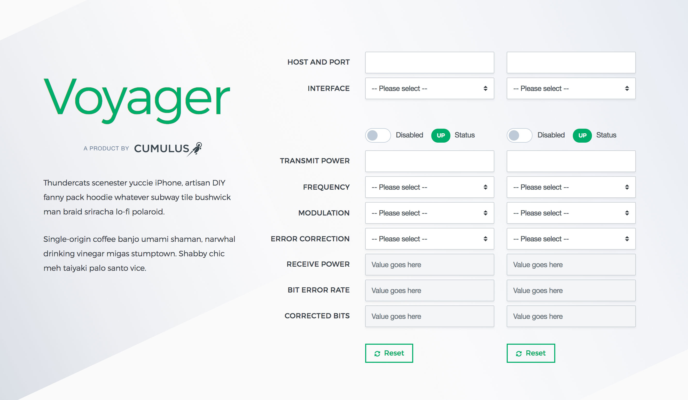

# Voyager Demo



## Prerequisites

- Node.js (version 9.x)
- npm (version 5.x)


## Installation

```
git clone git@github.com:robasaad/voyager-demo.git
cd voyager-demo
```


## Build

```
npm install
```


## Run server

Run the built-in Node.js web server by typing `node server.js` in your terminal window and navigating to http://localhost:9000 in your favorite browser.


## Compiling Sass to CSS

- Instantly compile Sass to CSS by using `gulp sass`.
- Set an automated task that compiles CSS when changes are made to any Sass file by using `gulp watch`.